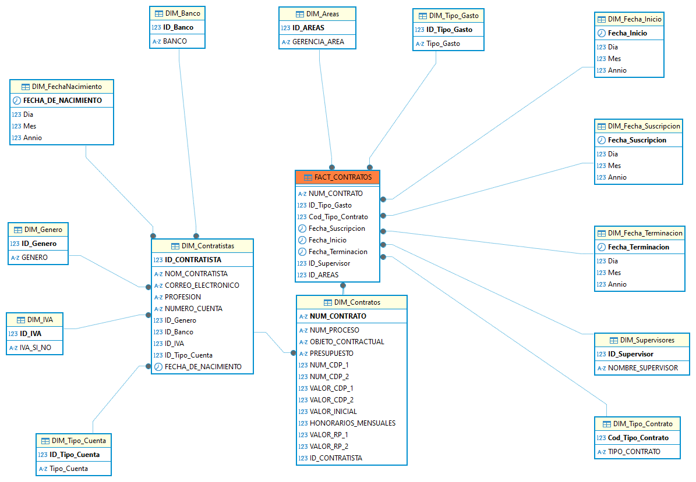

# Data Warehouse
Diseño de un almacen central de datos con modelado de dimensiones y hechos para la construcción de una base de datos de contratos del Metro de Bogotá.

Scripts: Contiene el código SQL de las tablas que almacenarán los datos extraídos, transformados y cargados desde el Data Lake.
ETL: Contiene los procesos de Extracción, Transformación y Carga de los datos contenidos en el Data Lake para ser cargados en el Data Warehouse.
Modelo ER: Modelo Entidad Relación de Copo de Nieve del Data Warehouse.
## Relación Copo de Nieve.

