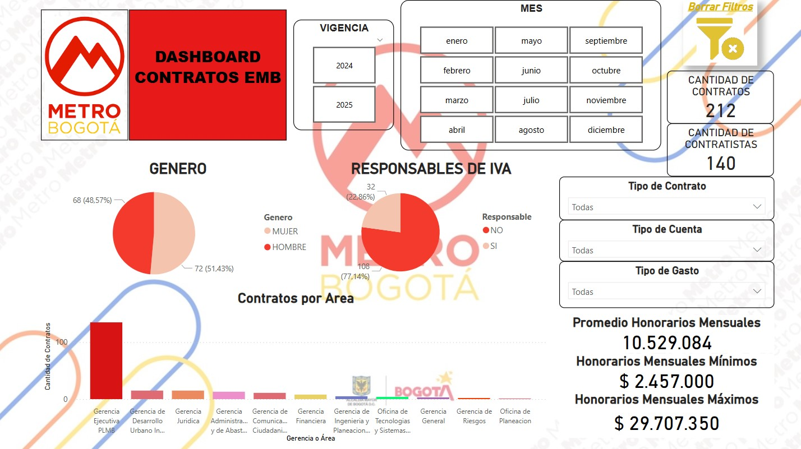
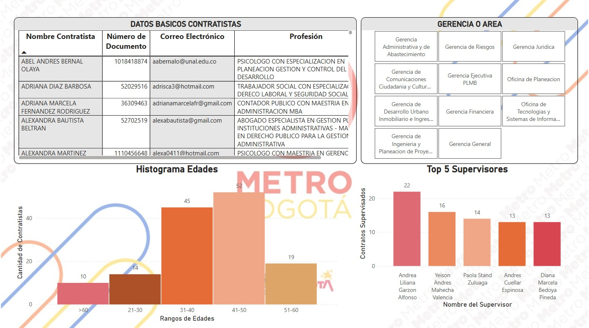

# Power BI
Diseño de un DashBoard utilizando Power BI para el analisis de la información de Contratos y Contratistas de la empresa Metro de Bogotá.
## 1. Segmentación de Datos.
El DashBoard cuenta con 2 hojas, en la primera se busca mostrar un resumen general de los datos más relevantes de la base de datos. Los segmentos y filtros aplicados son:
1. Filtro por vigencia.
2. Filtro por meses.
3. Cuenta de la cantidad de contratos.
4. Cuenta de la cantidad de contratistas.
5. Grafícas de torta para: Genero y Responsables de IVA.
6. Filtros para identificar las cantidades de contratos por tipo de contrato, tipo de cuenta y tipo de gasto.
7. Grafica de Barra que muestra la cantidad de contratos por área.
8. Promedio de honorarios mensuales.
9. Honorarios mensuales MAX y MIN.
10. Botón para borrar filtros. (Esquina superior derecha)

## 2. Detalle
En la segunda hoja encontramos información detallada de los contratistas, donde lo relevante es:
1. Tabla de información de de datos basicos de contratistas (Nombre contratista, numero de documento, correo electronico y profesión).
2. Filtro de Gerencia o área.
3. Histograma de edades.
4. Top 5 supervisores con mayor numero de contratos supervisados.

